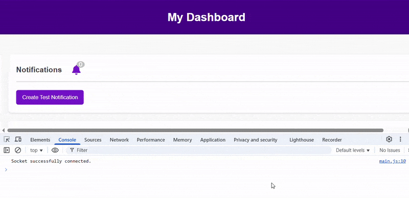
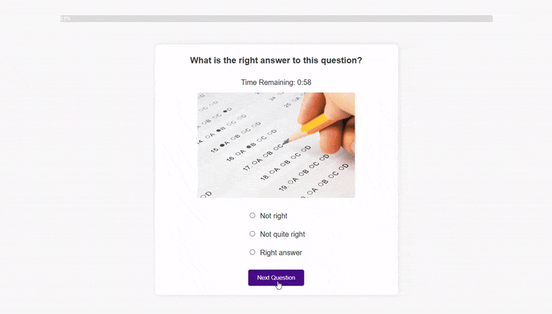

# Online Learning Platform 
#### Made by Alina Volkova, 2025
---
## Table of Contents
1. [About the Project](#about-the-project)
    * [Why This Project?](#why-this-project)
    * [Project Goals](#project-goals)

2. [Tech Stack, Deployment & Architecture](#tech-stack-deployment--architecture)
    * [Tech Stack](#️-tech-stack)
    * [Architectural Design](#️-architectural-design)

3. [Key Features](#key-features)
---

## About the Project
This fully-functional online learning platform allows students to enroll in courses, watch lecture videos, complete assignments, and take interactive quizzes—all while tracking their progress. Instructors can create and manage courses, upload lesson content, evaluate student submissions, and monitor overall engagement.

Designed for flexibility and ease of use, this platform combines modern web technologies to provide a seamless learning experience for both students and educators.

#### Why This Project?
As a self-taught developer, online learning platforms have played a crucial role in my education—allowing me to structure my learning and explore programming beyond traditional pathways. This project is both a tribute to the power of online education and a way to demonstrate my ability to design and implement scalable, interactive web applications.

#### Project Goals
- Scalability & Modularity – Clean architecture for future expansion
- Practical Full-Stack Implementation 
- Intuitive, User-Centric Design 

---
## Tech Stack, Deployment & Architecture  

### ⚙️ Tech Stack  
- **Backend:** Python, Django, Django REST Framework (DRF)  
- **Frontend:** HTML, CSS(fully custom, responsive design), JavaScript, AJAX  
- **Database:** SQLite
- **Real-time Functionality:** Django Channels (WebSockets)  
- **Authentication:** Django’s built-in authentication system with role-based access
&nbsp;
### 🌐 Deployment Details
This project is **fully deployed**:

- Hosted on **Railway** using **Daphne ASGI** for real-time WebSocket connections.
- **AWS S3** integration for **scalable media storage**, ensuring efficient file handling.
- Secure environment management, keeping sensitive data protected with **environment variables**.
- Optimized static & media file handling for smooth performance.

&nbsp;
### 🏗️ Architectural Design  

#### **Role-Based System**  
- Unlike simpler applications with a single user type, this platform **supports two roles** with distinct dashboards and permissions:  
  - **Students:** Track progress, watch lectures, complete assignments, take quizzes, and resume lessons.  
  - **Instructors:** Manage courses and lessons, grade assignments, send announcements, and monitor student performance.  

#### **Modular App Structure**  
- The project follows a **multi-app Django structure** for separation of concerns:  
  - `users` – Handles general-purpose functionality, including user authentication, anonymous browsing, viewing and enrolling in courses. It also manages shared models used across the project and the WebSocket configuration.
  - `learning` – Manages functionality and features available to students after enrolling in at least one course. 
  - `teaching` – Instructor-specific functionality: tools to manage courses, lessons, view/grade assignments and interact with students.  

#### **Database Design & Optimization**  
- **15+ models** structured for clarity, avoiding bloated tables.  
- **Through-model (LessonCompletion)** tracks student progress without bloating the `Lesson` model.  
- **Efficient Many-to-Many relationships** (e.g., courses categorized into multiple fields of study as well as levels).  
- **Custom model methods** simplify repetitive calculations (e.g., progress tracking, average grades).  

#### **Frontend & UX Enhancements**  
- **AJAX-powered interactivity**: Inline editing, UI/UX togglers, quiz timers, page updates without reloads.  
- **PDF.js integration**: View assignments directly in the browser without downloading.  
- **Custom CSS & media queries** for a fully responsive, mobile-friendly design.  

---
##  Key Features  

###  Intuitive Learning Experience  
- **Smart dashboard system** tailored separately for **students** and **instructors**.   
- Course and Lesson management with **inline editing (AJAX) and Django REST API support** by instructors.
- **Smooth lesson navigation** with:  
  - Embedded video player  
  - Downloadable resources  
  - Homework Requirements & Assignment Submission
- **Dynamic course catalog** with **filtering options** (by category, level).  
- **Comprehensive course pages** including syllabus, instructor details, and user reviews.  
-  **Modern, responsive and user-friendly UI** with an engaging **home page** featuring testimonials, FAQs and dynamic elements.

### Assignments & Grading  
- **PDF-based homework submissions** with in-app viewing for instructors.  
- **Grading system** that allows instructors to dynamically update scores. 
&nbsp; 

&nbsp;
### Advanced Features   
#### **Real-Time Feature**  
- **Live WebSocket-based notification system** enables sending real-time messages from instructors to students. 
Unlike traditional chat-based systems, this ensures focused, education-relevant communication.  
&nbsp;

🎥 **Live WebSocket Notification in Action**  
The test notification is sent via **Django Channels WebSockets**, instantly appearing on the page & console log (see `wss://` connection).  
&nbsp;
#### **Quizzes & Interactive Learning**  
- **Dynamic Quiz System** with:  
  - **Real-time feedback** (answer comparison & scores)  
  - **Timer system** with automatic submission on timeout  
  - **Progress tracking** while taking a quiz
  - One-question-per-card UX for better focus  
&nbsp;
   
&nbsp;

&nbsp;
#### 🚀 **Try It Yourself**
The platform is live and available for testing. If you'd like a deeper dive into the features, you can use the following credentials:

👩‍🎓 **Student Account**
Username: foo_student
Password: 12345qwerty

👨‍🏫 **Instructor Account**
Username: alice_white
Password: 12345qwerty

Feel free to explore the dashboards, test notifications,solve quizzes and interact with the platform firsthand. 
**Live Demo:** [Try it here](https://learning-platform-production.up.railway.app/)
&nbsp;

---
## ⚙️ Key Design Decisions  

- **Centralized Models:** Kept models in a single `models.py` since they are tightly connected, reducing unnecessary complexity.  
- **User & Profile Separation:** Split authentication data (`User`) from user-specific details (`Profile`) for flexibility in role-based permissions.  
- **Test Strategy:** Focused on feature workflows instead of redundant per-view tests. Currently excludes WebSocket & JavaScript-dependent features.  
- **Views Approach:** Used a mix of FBVs, CBVs, and DRF to demonstrate adaptability:
    - FBVs for fundamental logic control.
    - CBVs for reusable & structured views.
    - DRF for API-driven interactions.  
- **Mix of Server-Rendered & API Views:**  
    - Forms & file uploads → traditional Django views.  
    - Dynamic updates & inline editing → DRF APIs.  

